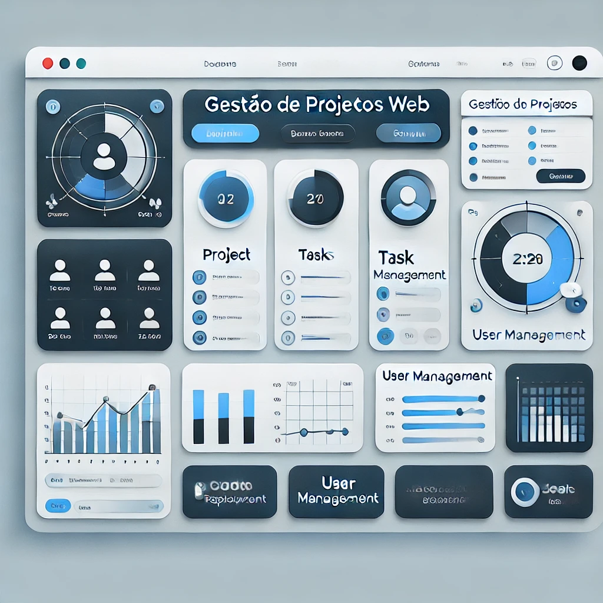
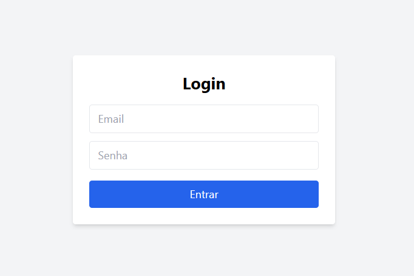
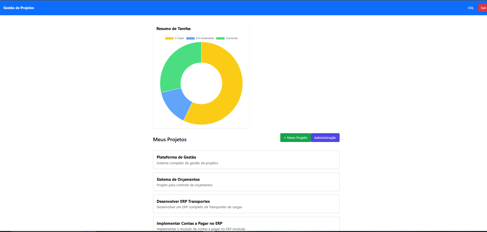
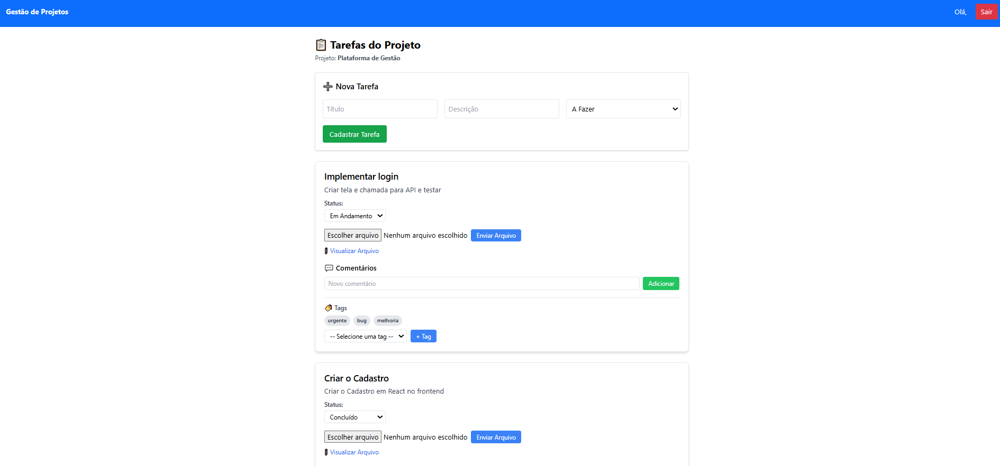
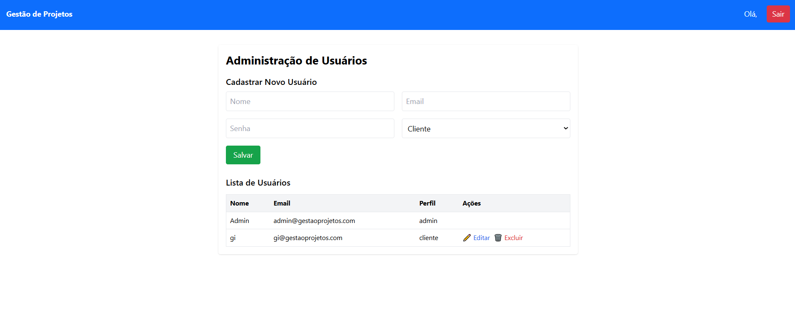

# 🧠 Gestão de Projetos Web

Sistema completo de gestão de projetos desenvolvido com **React**, **Node.js** e **Sequelize + SQL Server**. Permite o controle de tarefas, comentários, arquivos, tags, usuários e permissões — com autenticação via JWT.

---

## 🚀 Tecnologias Utilizadas

- **Frontend:** React.js + Tailwind CSS
- **Backend:** Node.js + Express
- **Banco de Dados:** SQL Server (ORM: Sequelize)
- **Autenticação:** JWT
- **Upload de Arquivos:** Multer
- **Outros:** Axios, React Router DOM

---

## 🔐 Funcionalidades

### 👤 Login e Autenticação

- Autenticação com JWT (login com token)
- Redirecionamento por perfil (cliente ou admin)
- Tela de login com retorno de token
- Cadastro e gerenciamento de projetos por usuário
- CRUD de tarefas por projeto
- Controle de status das tarefas (todo, em andamento, concluído)
- Comentários por tarefa
- Upload e visualização de arquivos anexados
- Tags associadas às tarefas
- Dashboard com resumo gráfico (tarefas por status)
- Painel administrativo para gerenciamento de usuários (apenas admin)

---

### 📁 Administração de Projetos
- Cadastro, edição e exclusão de projetos
- Visualização de tarefas por projeto

---

### ✅ Gestão de Tarefas
- Criação de tarefas com status (A Fazer, Em Andamento, Concluído)
- Comentários por tarefa
- Upload de arquivos
- Associação de tags

---

### 🔧 Painel Administrativo
- Cadastro, edição e exclusão de usuários
- Permissões por perfil (`admin` ou `cliente`)

---

### 📊 Dashboard
- Resumo visual com gráfico de status das tarefas

---

## 🔐 Perfis de usuário

Tipo	Permissões principais
admin	Gerencia usuários e projetos
cliente	Gerencia apenas seus próprios projetos e tarefas

---

## 🧠 Estrutura do Projeto

gestao-projetos/ ├── backend-gestao-projetos/ │ └── Node.js + Express + SQL Server ├── frontend-gestao-projetos/ │ └── React.js + Context API + Axios

---

## 🧠 Estrutura do Pastas

├── backend-gestao-projetos
│   ├── controllers
│   ├── models
│   ├── routes
│   ├── middlewares
│   └── config
└── frontend-gestao-projetos
    ├── pages
    ├── components
    ├── context
    └── services

---

## 🖥️ Como rodar o projeto localmente

1. Clone este repositório
git clone https://github.com/seu-usuario/gestao-projetos.git
cd gestao-projetos

2. Crie o banco de dados no SQL Server
Crie um banco chamado GestaoProjetos
Execute os scripts da pasta scripts/sql (se aplicável)
Configure as variáveis no .env

3. Configuração do backend
cd backend-gestao-projetos
cp .env.example .env
npm install
npx sequelize db:migrate   # se houver migrations
npx sequelize db:seed:all   # se houver seeds
npm run dev

4. Configuração do frontend
cd ../frontend-gestao-projetos
npm install
npm start

 5. 🔑 Variáveis de ambiente (.env)
.env backend
DB_HOST=localhost
DB_PORT=1433
DB_NAME=GestaoProjetos
DB_USER=sa
DB_PASS=suasenha
JWT_SECRET=sua_chave_secreta
---

## 🔑 Acesso Rápido

Use as credenciais abaixo após rodar o backend (ou cadastre via Postman):
Email: admin@gestaoprojetos.com
Senha: 123456

---

📸 Prints do sistema

---

📬 Contato
Desenvolvedor: Andrei Toledo
📧 Email: andreiltoledo@hotmail.com
LinkedIn: https://linkedin.com/in/andreilucianotoledo/

---

